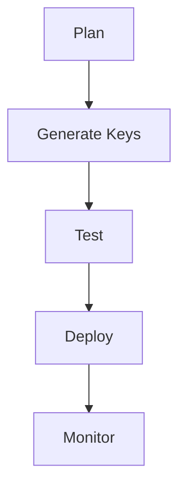

# Workflows & Runbooks

Operational playbooks for key tasks.

## 1. Key Rotation

- Double‑sign during overlap window
- Rollback key registry if validation fails

## 2. Hot‑Patch

- Verify package signature and manifest
- Activate under guard; pre‑flight tests
- Keep rollback always available

## 3. Incident Handling

- Contain → Patch → Validate → Retrospective
- Keep timelines and evidence; never leak secrets in reports